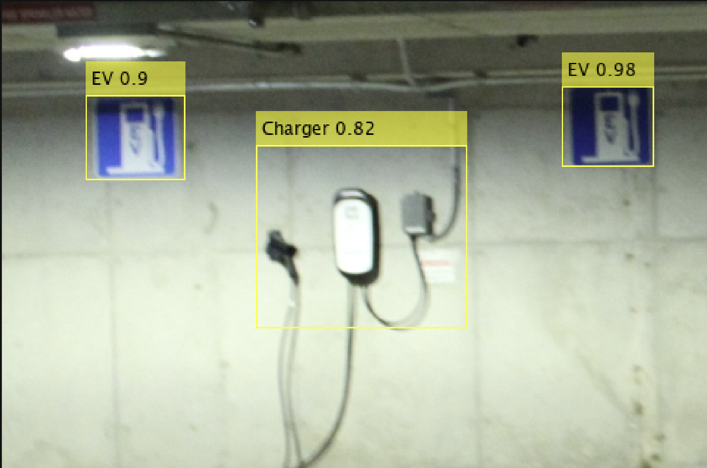

# Parking Sign Detection using YOLOv4


*Example of the model detecting EV charging stations, accessible parking signs, and electric vehicles*

## Overview

This project implements a deep learning-based object detection system for parking infrastructure using YOLOv4. The model is trained to detect three key classes in parking environments:
- **EV**: Electric vehicles
- **Charger**: EV charging stations  
- **Accessible**: Accessible parking signs

The project was developed as part of a MathWorks Deep Learning for Object Detection course, demonstrating transfer learning techniques and comprehensive model evaluation.

## Features

- **Multi-class Detection**: Simultaneously detects electric vehicles, charging stations, and accessible parking signs
- **Transfer Learning**: Built upon pre-trained YOLOv4 "tiny-yolov4-coco" backbone for efficient training
- **Comprehensive Evaluation**: Includes precision-recall curves, confusion matrices, and mAP metrics
- **Anchor Box Optimization**: Uses K-means clustering to determine optimal anchor boxes
- **Threshold Optimization**: Automated detection threshold tuning for best performance
- **Data Analysis Tools**: Outlier detection and bounding box statistics analysis

## Model Performance

| Class | Objects | AP@0.5 | AP@0.25 |
|-------|---------|--------|---------|
| EV | 223 | 0.8666 | 0.9430 |
| Charger | 106 | 0.6766 | 0.8184 |
| Accessible | 167 | 0.6756 | 0.7627 |

**Overall mAP@0.5**: 0.7396  
**Overall mAP@0.25**: 0.8414

## Dataset

- **Total Images**: 400
- **Total Objects**: 496
- **Training/Validation Split**: 80/20
- **Input Size**: 320×480×3 pixels

### Class Distribution
- Electric Vehicles: 223 instances across 201 images
- Accessible Signs: 167 instances across 144 images  
- Chargers: 106 instances across 106 images

## Architecture

The model uses YOLOv4 architecture with:
- **Backbone**: Tiny-YOLOv4-COCO (pre-trained)
- **Anchor Boxes**: 12 optimized anchor boxes (6 per detection scale)
- **Input Resolution**: 320×480 pixels
- **Detection Scales**: 2 scales for multi-scale detection

## Files Structure

```
├── model/
│   └── trained_yolov4_detector.mat     # Trained model weights (60 epochs)
├── labeled_data/
│   └── parkingTrainGTFINISHED.mat      # Ground truth annotations
├── training_model.mlx                  # Model training script
├── evaluating_model.mlx                # Model evaluation and testing
├── analyzing_data.mlx                  # Data analysis and visualization
└── README.md                           # This file
```

## Training Details

### Training Parameters
- **Optimizer**: Adam
- **Learning Rate**: 0.001
- **Batch Size**: 64
- **Epochs**: 60
- **L2 Regularization**: 0.001
- **Validation Frequency**: Every 5 epochs

### Training Progress
The model achieved excellent convergence over 60 epochs, showing substantial improvement compared to the initial 20-epoch training run.

<!-- 
*Training and validation loss curves over 60 epochs*

## Evaluation Metrics

### Precision-Recall Curves

*Precision-recall curves for each class at different IoU thresholds*

### Confusion Matrix

*Confusion matrix showing classification performance*

### Detection Threshold Analysis

*mAP vs Detection Threshold curve for optimal threshold selection*

## Data Analysis

### Bounding Box Statistics

*Scatter plot showing area vs aspect ratio distribution for each class*

### Box Plots

*Box plots showing aspect ratio distribution by class*


*Box plots showing area distribution by class* -->

## Requirements

- MATLAB R2020b or later
- Computer Vision Toolbox
- Deep Learning Toolbox
- Image Processing Toolbox

## Usage

### Training a New Model
```matlab
% Load the training script
run('training_model.mlx')
```

### Evaluating the Model
```matlab
% Load the evaluation script  
run('evaluating_model.mlx')
```

### Analyzing Data
```matlab
% Load the data analysis script
run('analyzing_data.mlx')
```

### Running Inference
```matlab
% Load trained detector
load('trained_yolov4_detector.mat', 'detector');

% Detect objects in new image
img = imread('your_image.jpg');
[bboxes, scores, labels] = detect(detector, img, 'Threshold', 0.05);

% Visualize results
detectedImg = insertObjectAnnotation(img, 'rectangle', bboxes, labels);
imshow(detectedImg);
```

## Key Insights

1. **Significant Performance Improvement**: Extended training from 20 to 60 epochs resulted in dramatic improvements:
   - Overall mAP@0.5 increased from 0.3408 to **0.7396** (+117% improvement)
   - All classes showed substantial gains in detection accuracy

2. **EV Detection**: Achieved excellent performance (AP@0.5: 0.8666), confirming that larger objects with distinct features are easiest to detect

3. **Charger Detection**: Showed remarkable improvement (AP@0.5: 0.1359 → 0.6766), demonstrating the benefit of extended training for challenging small objects

4. **Accessible Signs**: Improved significantly (AP@0.5: 0.3464 → 0.6756), benefiting from the additional training epochs

5. **Training Duration Impact**: The results clearly demonstrate that sufficient training time is crucial for optimal performance in object detection tasks

## Acknowledgments

This project was completed as part of the MathWorks Deep Learning for Object Detection course. The YOLOv4 implementation is based on the MATLAB Computer Vision Toolbox.